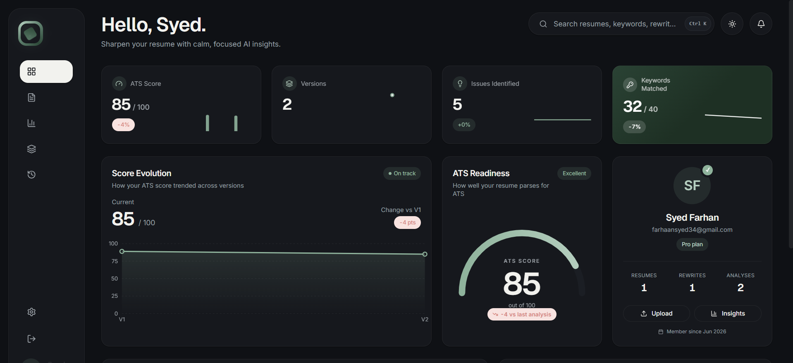
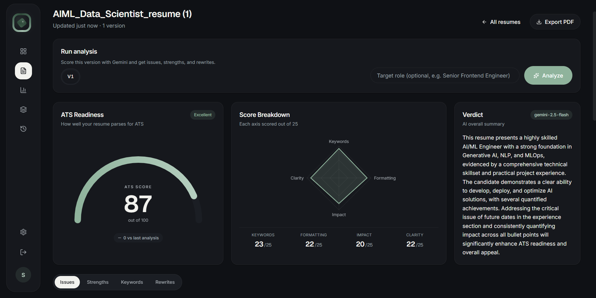

# 🚀 ResumeForge AI - Intelligent ATS Resume Analyzer & Tailoring Platform



**ResumeForge AI** is a powerful SaaS platform designed to help job seekers optimize their resumes for Applicant Tracking Systems (ATS). Leveraging the Google Gemini AI, it parses, analyzes, and provides actionable insights and dynamic rewrites to transform a good resume into a great one.

---

## ✨ Key Features

- **📊 Intelligent ATS Scoring:** Upload any PDF resume and receive an instant ATS-readiness score (0-100), broken down by Keywords, Formatting, Impact, and Clarity.
- **🎯 Keyword Optimization:** Instantly identifies which critical keywords your resume is missing based on your target role, and highlights the ones you've successfully matched.
- **💡 Smart Bullet Rewriting:** Automatically identifies weak experience bullet points and provides AI-generated, quantified, and ATS-friendly rewrites with clear rationales.
- **🔄 Version Control & History:** Seamlessly manage multiple versions of your resume. Apply AI rewrites to generate a new version, and visually track your ATS score improvements over time.
- **🔍 Granular Issue Tracking:** Get a prioritized list of issues with exact explanations and actionable fixes.
- **🔐 Secure Authentication:** JWT-based robust authentication system ensuring user privacy and data protection.

---

## 📸 Platform Highlights

### In-Depth AI Analysis
Dive deep into your resume's metrics, discover missing keywords, and get tailored recommendations.



---

## 🛠️ Tech Stack

**Frontend**
- **Framework:** React 18 (Vite)
- **Styling:** Tailwind CSS
- **Routing:** React Router DOM

**Backend**
- **Server:** Node.js & Express
- **Database:** MongoDB & Mongoose
- **Validation:** Zod
- **AI Integration:** Google Gemini API (`@google/genai`)
- **PDF Processing:** Multer & custom PDF extractors

---

## 🚀 Getting Started

Follow these instructions to get the project up and running on your local machine.

### Prerequisites
- Node.js (v18 or higher)
- MongoDB account/cluster

### 1. Clone the repository
```bash
git clone https://github.com/syedfarhaan-dev/ResumeForge-AI-Intelligent-ATS-Resume-Analyzer-Tailoring-Platform.git
cd ResumeForge-AI-Intelligent-ATS-Resume-Analyzer-Tailoring-Platform
```

### 2. Setup the Backend
Navigate to the `backend` directory and install dependencies:
```bash
cd backend
npm install
```

Create a `.env` file in the `backend` directory and add the following variables:
```env
PORT = 5000
NODE_ENV = development
MONGO_URI = <your_mongodb_connection_string>
JWT_SECRET = <your_secure_jwt_secret>
JWT_EXPIRES_IN = 7d
COOKIE_NAME = arr_token
CLIENT_ORIGIN = http://localhost:5173
GEMINI_API_KEY = <your_google_gemini_api_key>
GEMINI_MODEL = gemini-2.5-flash
```

Start the backend development server:
```bash
npm run dev
```

### 3. Setup the Frontend
Open a new terminal window, navigate to the `frontend` directory, and install dependencies:
```bash
cd frontend
npm install
```

Start the frontend development server:
```bash
npm run dev
```

The application will now be running on `http://localhost:5173`.

---

## 🤝 Contributing

Contributions, issues, and feature requests are welcome! Feel free to check the [issues page](https://github.com/syedfarhaan-dev/ResumeForge-AI-Intelligent-ATS-Resume-Analyzer-Tailoring-Platform/issues).

## 📄 License

This project is open-source and available under the [MIT License](LICENSE).
